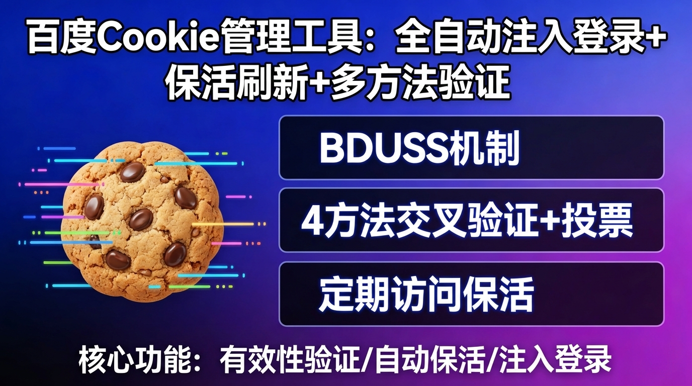

<div align="center">


<br/>
<br/>

# `Baidu Cookie Manager`

<h3>百度 Cookie 全生命周期自动化引擎 v3.0</h3>

<p>
  
  
  
  
  
  
</p>

<p>
  
  
  
</p>

<br/>

<a href="https://www.bilibili.com/video/BV1qTF8zFEyG/">
  
</a>

<br/>
<br/>

<a href="https://www.bilibili.com/video/BV1qTF8zFEyG/">
  
</a>

<br/>
<br/>

```
  ____        _     _          ____ _  __
 | __ )  __ _(_) __| |_   _  / ___| |/ /
 |  _ \ / _` | |/ _` | | | || |   | ' / 
 | |_) | (_| | | (_| | |_| || |___| . \ 
 |____/ \__,_|_|\__,_|\__,_| \____|_|\_\
                                          
  Cookie Lifecycle Automation Engine v3.0
```

> **严格 TBS+Passport 双重验证 | 5 端点全登录态校验 | 反检测 Selenium | GUI 可视化管理**

</div>

<br/>

## Architecture / 系统架构

```
                     +--------------------+
                     |   GUI 可视化界面    |
                     | CustomTkinter 暗色  |
                     +--------+-----------+
                              |
                     +--------v-----------+
                     |    输入层           |
                     |   待保活.txt        |
                     +--------+-----------+
                              |
                     +--------v-----------+
                     |   CKFileParser     |
                     |  格式解析 & 编码清洗  |
                     +--------+-----------+
                              |
        +---------------------+---------------------+
        |                     |                     |
 +------v------+     +--------v--------+    +-------v--------+
 |  Verify     |     |  Inject         |    |  Keep-Alive    |
 |  验证引擎    |     |  注入引擎        |    |  保活引擎       |
 |             |     |                 |    |                |
 | TBS+Passport|     | Selenium CDP    |    | 5 严格端点      |
 | 双重校验     |     | 服务端验证注入   |    | 三段式验证      |
 +------+------+     +--------+--------+    +-------+--------+
        |                     |                     |
        +---------------------+---------------------+
                              |
                     +--------v-----------+
                     |    输出层           |
                     |  保活成功.txt       |
                     |  backup.json       |
                     +--------------------+
```

<br/>

## Tech Stack / 技术栈

| 层级 | 技术 | 用途 |
|:---:|:---:|:---:|
| **运行环境** | `Python 3.8+` | 核心引擎 |
| **GUI 界面** | `CustomTkinter` | 暗色科技风可视化管理 |
| **HTTP 客户端** | `Requests 2.31+` | 轻量保活 & Cookie 验证 |
| **浏览器自动化** | `Selenium 4.15+` | Cookie 注入 & 深度刷新 |
| **浏览器协议** | `Chrome DevTools Protocol` | 反检测绕过 & Cookie 隔离 |
| **驱动管理** | `ChromeDriver Auto` | Selenium 4.6+ 内置管理 |
| **数据持久化** | `JSON + TXT` | 双格式备份输出 |

<br/>

## Core Modules / 核心模块

<table>
  <tr>
    <td align="center" width="25%">
      <br/><br/>
      <b>TBS+Passport 双重验证</b><br/><br/>
      <code>贴吧 TBS is_login</code><br/>
      <code>Passport 302 检测</code><br/>
      <code>网盘 errno 校验</code><br/>
      <code>文库 code 校验</code><br/><br/>
      <sub>服务端真实登录态验证</sub>
    </td>
    <td align="center" width="25%">
      <br/><br/>
      <b>Selenium Cookie 注入</b><br/><br/>
      <code>CDP 全域 Cookie 清除</code><br/>
      <code>跨账号隔离防串混</code><br/>
      <code>注入后服务端验证</code><br/>
      <code>反检测 webdriver</code><br/><br/>
      <sub>注入即验证 杜绝假成功</sub>
    </td>
    <td align="center" width="25%">
      <br/><br/>
      <b>5 端点严格保活</b><br/><br/>
      <code>Passport 中心</code><br/>
      <code>贴吧 TBS</code><br/>
      <code>网盘用户信息</code><br/>
      <code>贴吧关注列表</code><br/>
      <code>文库用户信息</code><br/><br/>
      <sub>每个端点独立验证登录态</sub>
    </td>
    <td align="center" width="25%">
      <br/><br/>
      <b>CustomTkinter 界面</b><br/><br/>
      <code>暗色科技风主题</code><br/>
      <code>账号列表管理</code><br/>
      <code>一键删除账号</code><br/>
      <code>STOP 任务中断</code><br/><br/>
      <sub>可视化操作 零门槛使用</sub>
    </td>
  </tr>
</table>

<br/>

## BDUSS Mechanism / 认证机制原理

BDUSS 是百度核心身份凭证，理解其生命周期是 Cookie 管理的关键。

```
 BDUSS (192 字符 Base64 编码)
 +------------------------------------------------------------+
 | 会话加密数据 | JCQAAAA 分隔符 | 用户名 B64 编码 | 时间戳签名  |
 +------------------------------------------------------------+
       |
       +-- 作用域: *.baidu.com (全域通行)
       +-- 安全性: HttpOnly 保护 (JS 无法读取)
       +-- 有效期: 服务端控制，永不自动过期
       +-- 失效方式: 主动退出 / 风控封禁 / 密码修改
       |
       +----> STOKEN = f(BDUSS, PTOKEN) 贴吧签到等操作需要
       +----> BDUSS_BFESS = BDUSS 的 HTTPS 安全增强版
       +----> STOKEN_BFESS = STOKEN 的 HTTPS 安全增强版
```

### BDUSS 全站权限矩阵（实测）

| 百度产品 | 有效 BDUSS | 失效 BDUSS | 验证方式 |
|:---:|:---:|:---:|:---:|
| Passport 个人中心 | 200 | 302 跳转 | HTTP 状态码 |
| 贴吧 TBS | is_login=1 | is_login=0 | JSON 字段 |
| 网盘用户信息 | errno=0 | errno=-6 | JSON 字段 |
| 文库用户信息 | code=0 | code=200001 | JSON 字段 |
| 贴吧关注列表 | 200 | 302 跳转 | HTTP 状态码 |
| 百科个人页 | 200 | 302 跳转 | HTTP 状态码 |
| 百度首页 | 200 | 200 | 无法区分 |
| 好看视频 | 200 | 200 | 无法区分 |

> BDUSS 是全有或全无的：有效时全站通行，失效时全站拒绝。不存在"只对某个产品有效"的情况。

### Strict Validation Pipeline / 严格验证流水线

```
输入: BDUSS Cookie
  |
  +--[前置] TBS is_login ---------> 1 = 有效 / 0 = 失效
  +--[前置] Passport Center ------> 200 = 有效 / 302 = 失效
  |
  +--[失效?] 直接标记掉线，跳过保活（不浪费请求）
  |
  +--[有效] 访问 5 个严格端点 -----> 每个独立验证登录态
  |    Passport中心 (200/302)
  |    贴吧TBS (is_login)
  |    网盘用户信息 (errno)
  |    贴吧关注列表 (200/302)
  |    文库用户信息 (code)
  |
  +--[最终] 再次 TBS+Passport 验证 -> 确认保活后仍然有效
```

### Keep-Alive Strategy / 保活策略

```
前置验证(TBS+Passport) --> 5 严格端点 --> 随机延迟(1~3s) --> 最终验证
     |                        |              |                |
     +-- 无效直接拦截         +-- 每个端点    +-- 防风控策略    +-- 确认仍有效
     +-- 不浪费请求           +-- 独立验证    +-- Set-Cookie   +-- 杜绝假成功
```

<br/>

## Quick Preview / 命令速览

```bash
# 检查 Cookie 有效性（4 方法交叉验证）
$ python baidu_ck_manager.py check

# 轻量保活（推荐日常使用）
$ python baidu_ck_manager.py keepalive

# Selenium 浏览器注入登录
$ python baidu_ck_manager.py login

# 浏览器深度刷新 Cookie
$ python baidu_ck_manager.py refresh

# 定时自动保活（默认每 6 小时）
$ python baidu_ck_manager.py schedule --interval 6

# 处理单个账号
$ python baidu_ck_manager.py single -i 0
```

<br/>

## Output Example / 运行效果

```
[keepalive] browser_account 轻量级保活...
  BDUSS验证通过，开始访问保活接口...
  [OK] Passport中心 (已登录, status=200)
  [OK] 贴吧TBS (已登录, is_login=1)
  [OK] 网盘用户信息 (已登录, errno=0)
  [OK] 贴吧关注列表 (已登录, status=200)
  [OK] 文库用户信息 (已登录, code=0)
  保活完成，访问 5/5 个接口，BDUSS验证有效

[keepalive] invalid_account 轻量级保活...
  BDUSS已失效，无法保活，需重新登录获取Cookie

[inject] browser_account Cookie注入登录...
  注入Cookie: BDUSS=laUWxyVFB1QjFo...
  登录验证通过 - BDUSS服务端验证有效
  Cookie注入登录成功!
```

<br/>

## Project Structure / 项目结构

```
baidu-cookie-manager/
|
+-- baidu_ck_manager.py           # 核心引擎 (验证/注入/保活/封禁检测)
+-- baidu_ck_gui.py               # GUI 界面 (CustomTkinter 暗色科技风)
+-- test_single_ck.py             # BDUSS 深度测试 (结构分析/全站权限矩阵)
+-- ruliu_to_standard_bduss.py    # 如流账号转标准 BDUSS (Selenium 自动登录)
+-- requirements.txt               # 依赖: selenium, requests, customtkinter
+-- 待保活.txt                      # 输入: 账号 + Cookie 数据
+-- 保活成功.txt                    # 输出: 有效账号 + 保活时间戳
+-- cookies_backup.json            # 输出: JSON 格式完整备份
+-- baidu_ck.log                   # 运行日志 (含时间戳)
```

<br/>

<div align="center">

## Get Source Code / 获取源码

<br/>


<br/>
<br/>

**本仓库仅提供项目说明与演示视频**

**完整源代码为付费内容，购买后提供一对一技术支持**

<br/>

| | |
|:---:|:---|
| **作者 Author** | **传康kk** |
| **微信 WeChat** | `1837620622` |
| **B站 Bilibili** | [传康kk](https://space.bilibili.com/) |
| **CSDN** | [万能程序员](https://blog.csdn.net/) |

<br/>


<br/>
<br/>

</div>

## Disclaimer / 免责声明

本工具仅供学习和研究使用。使用时请遵守百度的服务条款和相关法律法规，因不当使用造成的任何后果由使用者自行承担。
